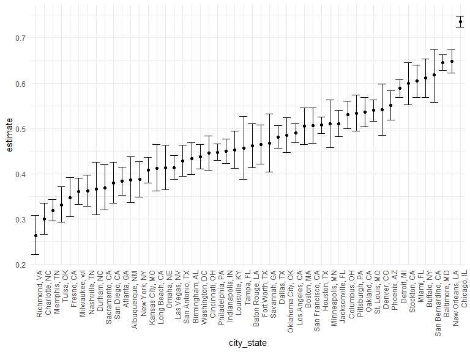
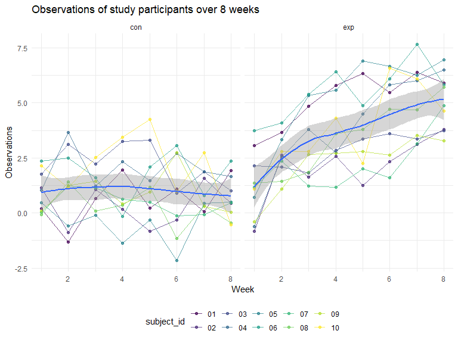

Homework 5
================
Pavithra Srinivasan
November 16, 2023

## Problem 1

For this problem, we are interested in data gathered and made public by
*The Washington Post* on homicides in 50 large U.S. cities. The code
chunk below imports and cleans the data.

``` r
homicide_df = 
  read_csv("data/homicide-data.csv", na = c("", "NA", "Unknown")) %>%
  mutate(
    city_state = str_c(city, state, sep = ", "),
    resolution = case_when(
      disposition == "Closed without arrest" ~ "unsolved",
      disposition == "Open/No arrest"        ~ "unsolved",
      disposition == "Closed by arrest"      ~ "solved"
    )
  ) %>% 
  filter(city_state != "Tulsa, AL") 
```

    ## Rows: 52179 Columns: 12
    ## ── Column specification ────────────────────────────────────────────────────────
    ## Delimiter: ","
    ## chr (8): uid, victim_last, victim_first, victim_race, victim_sex, city, stat...
    ## dbl (4): reported_date, victim_age, lat, lon
    ## 
    ## ℹ Use `spec()` to retrieve the full column specification for this data.
    ## ℹ Specify the column types or set `show_col_types = FALSE` to quiet this message.

The resulting dataframe has 52178 entries, on variables that include the
victim name, race, age, and sex; the date the homicide was reported; and
the location of the homicide. In cleaning, I created a `city_state`
variable that includes both city and state, and a `resolution` variable
to indicate whether the case was closed by arrest. I also excluded one
entry in Tulsa, AL, which is not a major US city and is most likely a
data entry error.

In the next code chunk, I group within cities and summarize to produce
the total number of homicides and the number that are solved.

``` r
city_homicide_df = 
  homicide_df %>% 
  select(city_state, disposition, resolution) %>% 
  group_by(city_state) %>% 
  summarize(
    hom_total = n(),
    hom_unsolved = sum(resolution == "unsolved"))
```

Focusing only on Baltimore, MD, I can use the `prop.test` and
`broom::tidy` functions to obtain an estimate and CI of the proportion
of unsolved homicides in that city. The table below shows those values.

``` r
bmore_test = 
  prop.test(
    x = filter(city_homicide_df, city_state == "Baltimore, MD") %>% pull(hom_unsolved),
    n = filter(city_homicide_df, city_state == "Baltimore, MD") %>% pull(hom_total)) 

broom::tidy(bmore_test) %>% 
  knitr::kable(digits = 3)
```

| estimate | statistic | p.value | parameter | conf.low | conf.high | method                                               | alternative |
|---------:|----------:|--------:|----------:|---------:|----------:|:-----------------------------------------------------|:------------|
|    0.646 |   239.011 |       0 |         1 |    0.628 |     0.663 | 1-sample proportions test with continuity correction | two.sided   |

Building on this code, I can use functions in the `purrr` package to
obtain estimates and CIs for the proportion of unsolved homicides in
each city in my dataset. The code below implements this analysis.

``` r
test_results = 
  city_homicide_df %>% 
  mutate(
    prop_tests = map2(hom_unsolved, hom_total, \(x, y) prop.test(x = x, n = y)),
    tidy_tests = map(prop_tests, broom::tidy)) %>% 
  select(-prop_tests) %>% 
  unnest(tidy_tests) %>% 
  select(city_state, estimate, conf.low, conf.high) %>% 
  mutate(city_state = fct_reorder(city_state, estimate))
```

Finally, I make a plot showing the estimate (and CI) of the proportion
of unsolved homicides in each city.

``` r
test_results %>% 
  mutate(city_state = fct_reorder(city_state, estimate)) %>% 
  ggplot(aes(x = city_state, y = estimate)) + 
  geom_point() + 
  geom_errorbar(aes(ymin = conf.low, ymax = conf.high)) + 
  theme(axis.text.x = element_text(angle = 90, hjust = 1))
```



This figure suggests a very wide range in the rate at which homicides
are solved – Chicago is noticeably high and, given the narrowness of the
CI, likely is the location of many homicides.

## Problem 2

Create a tidy dataframe containing data from all participants, including
the subject ID, arm, and observations over time:

Iterate file names and read in data for each subject and clean it:

``` r
file_names = list.files(path = "./data1", full.names = TRUE)

#Import and combining files

tidy_df = file_names |> 
  map_dfr(read_csv, .id = "participant_id") |> 
  mutate(study_arm = print(dir(path = "./data1", include.dirs = FALSE))) |> 
  mutate(study_arm = str_remove(study_arm, ".csv")) |> 
  separate(study_arm, into = c("study_arm", "subject_id")) |> 
  select(participant_id, study_arm, subject_id, everything())
```

    ## Rows: 1 Columns: 8
    ## ── Column specification ────────────────────────────────────────────────────────
    ## Delimiter: ","
    ## dbl (8): week_1, week_2, week_3, week_4, week_5, week_6, week_7, week_8
    ## 
    ## ℹ Use `spec()` to retrieve the full column specification for this data.
    ## ℹ Specify the column types or set `show_col_types = FALSE` to quiet this message.
    ## Rows: 1 Columns: 8
    ## ── Column specification ────────────────────────────────────────────────────────
    ## Delimiter: ","
    ## dbl (8): week_1, week_2, week_3, week_4, week_5, week_6, week_7, week_8
    ## 
    ## ℹ Use `spec()` to retrieve the full column specification for this data.
    ## ℹ Specify the column types or set `show_col_types = FALSE` to quiet this message.
    ## Rows: 1 Columns: 8
    ## ── Column specification ────────────────────────────────────────────────────────
    ## Delimiter: ","
    ## dbl (8): week_1, week_2, week_3, week_4, week_5, week_6, week_7, week_8
    ## 
    ## ℹ Use `spec()` to retrieve the full column specification for this data.
    ## ℹ Specify the column types or set `show_col_types = FALSE` to quiet this message.
    ## Rows: 1 Columns: 8
    ## ── Column specification ────────────────────────────────────────────────────────
    ## Delimiter: ","
    ## dbl (8): week_1, week_2, week_3, week_4, week_5, week_6, week_7, week_8
    ## 
    ## ℹ Use `spec()` to retrieve the full column specification for this data.
    ## ℹ Specify the column types or set `show_col_types = FALSE` to quiet this message.
    ## Rows: 1 Columns: 8
    ## ── Column specification ────────────────────────────────────────────────────────
    ## Delimiter: ","
    ## dbl (8): week_1, week_2, week_3, week_4, week_5, week_6, week_7, week_8
    ## 
    ## ℹ Use `spec()` to retrieve the full column specification for this data.
    ## ℹ Specify the column types or set `show_col_types = FALSE` to quiet this message.
    ## Rows: 1 Columns: 8
    ## ── Column specification ────────────────────────────────────────────────────────
    ## Delimiter: ","
    ## dbl (8): week_1, week_2, week_3, week_4, week_5, week_6, week_7, week_8
    ## 
    ## ℹ Use `spec()` to retrieve the full column specification for this data.
    ## ℹ Specify the column types or set `show_col_types = FALSE` to quiet this message.
    ## Rows: 1 Columns: 8
    ## ── Column specification ────────────────────────────────────────────────────────
    ## Delimiter: ","
    ## dbl (8): week_1, week_2, week_3, week_4, week_5, week_6, week_7, week_8
    ## 
    ## ℹ Use `spec()` to retrieve the full column specification for this data.
    ## ℹ Specify the column types or set `show_col_types = FALSE` to quiet this message.
    ## Rows: 1 Columns: 8
    ## ── Column specification ────────────────────────────────────────────────────────
    ## Delimiter: ","
    ## dbl (8): week_1, week_2, week_3, week_4, week_5, week_6, week_7, week_8
    ## 
    ## ℹ Use `spec()` to retrieve the full column specification for this data.
    ## ℹ Specify the column types or set `show_col_types = FALSE` to quiet this message.
    ## Rows: 1 Columns: 8
    ## ── Column specification ────────────────────────────────────────────────────────
    ## Delimiter: ","
    ## dbl (8): week_1, week_2, week_3, week_4, week_5, week_6, week_7, week_8
    ## 
    ## ℹ Use `spec()` to retrieve the full column specification for this data.
    ## ℹ Specify the column types or set `show_col_types = FALSE` to quiet this message.
    ## Rows: 1 Columns: 8
    ## ── Column specification ────────────────────────────────────────────────────────
    ## Delimiter: ","
    ## dbl (8): week_1, week_2, week_3, week_4, week_5, week_6, week_7, week_8
    ## 
    ## ℹ Use `spec()` to retrieve the full column specification for this data.
    ## ℹ Specify the column types or set `show_col_types = FALSE` to quiet this message.
    ## Rows: 1 Columns: 8
    ## ── Column specification ────────────────────────────────────────────────────────
    ## Delimiter: ","
    ## dbl (8): week_1, week_2, week_3, week_4, week_5, week_6, week_7, week_8
    ## 
    ## ℹ Use `spec()` to retrieve the full column specification for this data.
    ## ℹ Specify the column types or set `show_col_types = FALSE` to quiet this message.
    ## Rows: 1 Columns: 8
    ## ── Column specification ────────────────────────────────────────────────────────
    ## Delimiter: ","
    ## dbl (8): week_1, week_2, week_3, week_4, week_5, week_6, week_7, week_8
    ## 
    ## ℹ Use `spec()` to retrieve the full column specification for this data.
    ## ℹ Specify the column types or set `show_col_types = FALSE` to quiet this message.
    ## Rows: 1 Columns: 8
    ## ── Column specification ────────────────────────────────────────────────────────
    ## Delimiter: ","
    ## dbl (8): week_1, week_2, week_3, week_4, week_5, week_6, week_7, week_8
    ## 
    ## ℹ Use `spec()` to retrieve the full column specification for this data.
    ## ℹ Specify the column types or set `show_col_types = FALSE` to quiet this message.
    ## Rows: 1 Columns: 8
    ## ── Column specification ────────────────────────────────────────────────────────
    ## Delimiter: ","
    ## dbl (8): week_1, week_2, week_3, week_4, week_5, week_6, week_7, week_8
    ## 
    ## ℹ Use `spec()` to retrieve the full column specification for this data.
    ## ℹ Specify the column types or set `show_col_types = FALSE` to quiet this message.
    ## Rows: 1 Columns: 8
    ## ── Column specification ────────────────────────────────────────────────────────
    ## Delimiter: ","
    ## dbl (8): week_1, week_2, week_3, week_4, week_5, week_6, week_7, week_8
    ## 
    ## ℹ Use `spec()` to retrieve the full column specification for this data.
    ## ℹ Specify the column types or set `show_col_types = FALSE` to quiet this message.
    ## Rows: 1 Columns: 8
    ## ── Column specification ────────────────────────────────────────────────────────
    ## Delimiter: ","
    ## dbl (8): week_1, week_2, week_3, week_4, week_5, week_6, week_7, week_8
    ## 
    ## ℹ Use `spec()` to retrieve the full column specification for this data.
    ## ℹ Specify the column types or set `show_col_types = FALSE` to quiet this message.
    ## Rows: 1 Columns: 8
    ## ── Column specification ────────────────────────────────────────────────────────
    ## Delimiter: ","
    ## dbl (8): week_1, week_2, week_3, week_4, week_5, week_6, week_7, week_8
    ## 
    ## ℹ Use `spec()` to retrieve the full column specification for this data.
    ## ℹ Specify the column types or set `show_col_types = FALSE` to quiet this message.
    ## Rows: 1 Columns: 8
    ## ── Column specification ────────────────────────────────────────────────────────
    ## Delimiter: ","
    ## dbl (8): week_1, week_2, week_3, week_4, week_5, week_6, week_7, week_8
    ## 
    ## ℹ Use `spec()` to retrieve the full column specification for this data.
    ## ℹ Specify the column types or set `show_col_types = FALSE` to quiet this message.
    ## Rows: 1 Columns: 8
    ## ── Column specification ────────────────────────────────────────────────────────
    ## Delimiter: ","
    ## dbl (8): week_1, week_2, week_3, week_4, week_5, week_6, week_7, week_8
    ## 
    ## ℹ Use `spec()` to retrieve the full column specification for this data.
    ## ℹ Specify the column types or set `show_col_types = FALSE` to quiet this message.
    ## Rows: 1 Columns: 8
    ## ── Column specification ────────────────────────────────────────────────────────
    ## Delimiter: ","
    ## dbl (8): week_1, week_2, week_3, week_4, week_5, week_6, week_7, week_8
    ## 
    ## ℹ Use `spec()` to retrieve the full column specification for this data.
    ## ℹ Specify the column types or set `show_col_types = FALSE` to quiet this message.

    ##  [1] "con_01.csv" "con_02.csv" "con_03.csv" "con_04.csv" "con_05.csv"
    ##  [6] "con_06.csv" "con_07.csv" "con_08.csv" "con_09.csv" "con_10.csv"
    ## [11] "exp_01.csv" "exp_02.csv" "exp_03.csv" "exp_04.csv" "exp_05.csv"
    ## [16] "exp_06.csv" "exp_07.csv" "exp_08.csv" "exp_09.csv" "exp_10.csv"

``` r
tidy_df |> 
  knitr::kable(digits = 2)
```

| participant_id | study_arm | subject_id | week_1 | week_2 | week_3 | week_4 | week_5 | week_6 | week_7 | week_8 |
|:---------------|:----------|:-----------|-------:|-------:|-------:|-------:|-------:|-------:|-------:|-------:|
| 1              | con       | 01         |   0.20 |  -1.31 |   0.66 |   1.96 |   0.23 |   1.09 |   0.05 |   1.94 |
| 2              | con       | 02         |   1.13 |  -0.88 |   1.07 |   0.17 |  -0.83 |  -0.31 |   1.58 |   0.44 |
| 3              | con       | 03         |   1.77 |   3.11 |   2.22 |   3.26 |   3.31 |   0.89 |   1.88 |   1.01 |
| 4              | con       | 04         |   1.04 |   3.66 |   1.22 |   2.33 |   1.47 |   2.70 |   1.87 |   1.66 |
| 5              | con       | 05         |   0.47 |  -0.58 |  -0.09 |  -1.37 |  -0.32 |  -2.17 |   0.45 |   0.48 |
| 6              | con       | 06         |   2.37 |   2.50 |   1.59 |  -0.16 |   2.08 |   3.07 |   0.78 |   2.35 |
| 7              | con       | 07         |   0.03 |   1.21 |   1.13 |   0.64 |   0.49 |  -0.12 |  -0.07 |   0.46 |
| 8              | con       | 08         |  -0.08 |   1.42 |   0.09 |   0.36 |   1.18 |  -1.16 |   0.33 |  -0.44 |
| 9              | con       | 09         |   0.08 |   1.24 |   1.44 |   0.41 |   0.95 |   2.75 |   0.30 |   0.03 |
| 10             | con       | 10         |   2.14 |   1.15 |   2.52 |   3.44 |   4.26 |   0.97 |   2.73 |  -0.53 |
| 11             | exp       | 01         |   3.05 |   3.67 |   4.84 |   5.80 |   6.33 |   5.46 |   6.38 |   5.91 |
| 12             | exp       | 02         |  -0.84 |   2.63 |   1.64 |   2.58 |   1.24 |   2.32 |   3.11 |   3.78 |
| 13             | exp       | 03         |   2.15 |   2.08 |   1.82 |   2.84 |   3.36 |   3.61 |   3.37 |   3.74 |
| 14             | exp       | 04         |  -0.62 |   2.54 |   3.78 |   2.73 |   4.49 |   5.82 |   6.00 |   6.49 |
| 15             | exp       | 05         |   0.70 |   3.33 |   5.34 |   5.57 |   6.90 |   6.66 |   6.24 |   6.95 |
| 16             | exp       | 06         |   3.73 |   4.08 |   5.40 |   6.41 |   4.87 |   6.09 |   7.66 |   5.83 |
| 17             | exp       | 07         |   1.18 |   2.35 |   1.23 |   1.17 |   2.02 |   1.61 |   3.13 |   4.88 |
| 18             | exp       | 08         |   1.37 |   1.43 |   1.84 |   3.60 |   3.80 |   4.72 |   4.68 |   5.70 |
| 19             | exp       | 09         |  -0.40 |   1.08 |   2.66 |   2.70 |   2.80 |   2.64 |   3.51 |   3.27 |
| 20             | exp       | 10         |   1.09 |   2.80 |   2.80 |   4.30 |   2.25 |   6.57 |   6.09 |   4.64 |

``` r
#Cleaning

tidy_df = tidy_df |> 
  pivot_longer(
    week_1:week_8,
    names_to = "week",
    values_to = "observations",
    names_prefix = "week_"
  ) |> 
  mutate(week = as.numeric(week))

tidy_df |> 
  head()
```

    ## # A tibble: 6 × 5
    ##   participant_id study_arm subject_id  week observations
    ##   <chr>          <chr>     <chr>      <dbl>        <dbl>
    ## 1 1              con       01             1         0.2 
    ## 2 1              con       01             2        -1.31
    ## 3 1              con       01             3         0.66
    ## 4 1              con       01             4         1.96
    ## 5 1              con       01             5         0.23
    ## 6 1              con       01             6         1.09

### Lets Visualize by creating a spaghetti plot

``` r
spaghetti_plot = tidy_df |>
  group_by(subject_id) |> 
  ggplot(aes(x = week, y = observations)) + 
           geom_point(alpha = 0.7, aes(color = subject_id)) +  geom_line(alpha = 0.7, aes(color = subject_id)) +
          geom_smooth() +
  labs(
    title = "Observations of study participants over 8 weeks",
    x = "Week",
    y = "Observations"
  ) +
  facet_grid(. ~ study_arm)

spaghetti_plot
```

    ## `geom_smooth()` using method = 'loess' and formula = 'y ~ x'



Interpretation: The Control arm is more constant for all the
participants over the course of the 8 weeks. Whereas, there is an
increase in the number of observations in the Experimental arm
especially from week 2. Participant 4 had the most fluctuations in both
the control and experimental groups, and participant 10 had the most
erratic fluctuations in the experiment group.

## Problem 3
